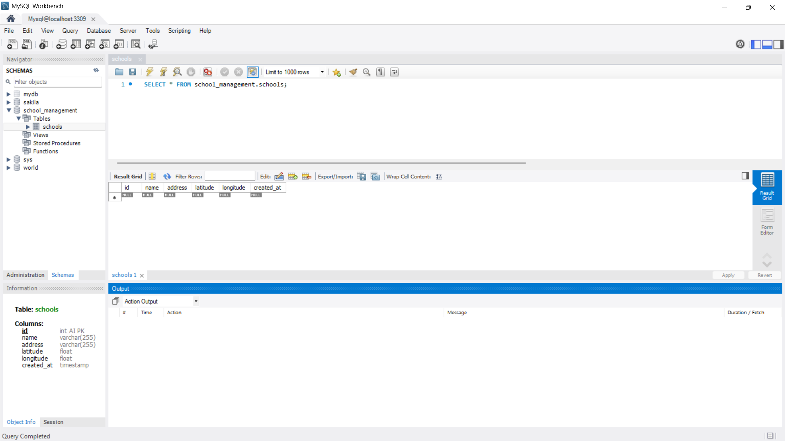

# Node.js School Management API

A streamlined Node.js API for school management with Express.js and MySQL. This API allows you to add schools with their geographical coordinates and retrieve schools sorted by proximity to a specified location.



## Features

- Add schools with location information (name, address, latitude, longitude)
- List schools sorted by proximity to a given location using Haversine formula
- Health check endpoint for monitoring API status
- Automatic fallback to in-memory storage when database is unavailable
- Comprehensive error handling and validation
- MySQL database integration with automatic table creation

## Tech Stack

- **Backend**: Node.js, Express.js
- **Database**: MySQL
- **Testing**: Postman, custom Node.js test scripts

## Getting Started

### Prerequisites

- Node.js (v14+ recommended)
- MySQL database (v8+ recommended)
- Postman (for testing API endpoints)

### Installation

1. Clone the repository:
```bash
git clone https://github.com/priynshgupta/Node-JS-School-Management-API.git
```
2. Install dependencies:
```bash
npm install
```

3. Configure the database:
   - Create a MySQL database using the `database_setup.sql` script
   - Create a `.env` file in the root directory with the following content:
   ```
   PORT=3000
   DB_HOST=127.0.0.1
   DB_USER=root
   DB_PASSWORD=your_password_here
   DB_NAME=school_management
   DB_PORT=3306
   DB_SSL_ENABLED=true
   ```
   - Adjust the MySQL connection details according to your setup

### Database Setup

#### Using MySQL Workbench

1. Open MySQL Workbench and connect to your MySQL server
2. Run the following SQL script to create the database and tables:
```sql
CREATE DATABASE IF NOT EXISTS school_management;
USE school_management;

CREATE TABLE IF NOT EXISTS schools (
  id INT AUTO_INCREMENT PRIMARY KEY,
  name VARCHAR(255) NOT NULL,
  address VARCHAR(255) NOT NULL,
  latitude FLOAT NOT NULL,
  longitude FLOAT NOT NULL,
  created_at TIMESTAMP DEFAULT CURRENT_TIMESTAMP
);
```

#### Alternative: Manual Setup

You can run the SQL script from the command line:
```bash
mysql -u root -p < database_setup.sql
```

### Start the Application

Run the server:

```bash
# Development mode with auto-reload
npm run dev

# Production mode
npm start
```

## API Endpoints

### 1. Health Check

```
GET /health
```

Response:
```json
{
  "success": true,
  "message": "Server is running",
  "database": "connected",
  "timestamp": "2025-05-23T15:00:41.186Z"
}
```

### 2. Add a School

```
POST /addSchool
```

Request body:
```json
{
  "name": "School Name",
  "address": "School Address",
  "latitude": 40.7128,
  "longitude": -74.0060
}
```

Response:
```json
{
  "success": true,
  "message": "School added successfully",
  "data": {
    "id": 1,
    "name": "School Name",
    "address": "School Address",
    "latitude": 40.7128,
    "longitude": -74.0060
  }
}
```

### 3. List Schools by Proximity

```
GET /listSchools?latitude=40.7128&longitude=-74.0060
```

Response:
```json
{
  "success": true,
  "message": "Schools retrieved successfully",
  "data": [
    {
      "id": 1,
      "name": "Test High School",
      "address": "123 API Test Road",
      "latitude": 37.7749,
      "longitude": -122.419,
      "created_at": "2025-05-23T15:00:41.000Z",
      "distance": 0.03515643045689034
    },
    {
      "id": 2,
      "name": "Central High School",
      "address": "123 Main St, Anytown",
      "latitude": 40.7128,
      "longitude": -74.006,
      "created_at": "2025-05-23T14:55:33.000Z",
      "distance": 4129.08616505731
    }
  ]
}
```

## Environment Variables

Configure these in the `.env` file:

- `PORT`: Server port (default: 3000)
- `DB_HOST`: MySQL host (default: localhost)
- `DB_USER`: MySQL username (default: root)
- `DB_PASSWORD`: MySQL password
- `DB_NAME`: Database name (default: school_management)
- `DB_PORT`: MySQL port (default: 3306)
- `DB_SSL_ENABLED`: Enable SSL for DB connection (true/false)

## Testing the API

### Using the Test Scripts

We've included two test scripts to help verify your installation:

1. Basic health check: `node test-api.js`
2. Full API test: `node test-all-apis.js`

### Using Postman

You can also test the API using Postman. Import the provided collection file `simple-postman-collection.json`.

## Mock Mode

If the database is not available, the API will automatically switch to "mock mode" which uses in-memory storage. This is useful for development and testing when you don't have a database available.

## Troubleshooting

### Database Connection Issues

If you're having trouble connecting to the database:

1. Ensure MySQL is installed and running
2. Verify your database credentials in the `.env` file
3. Check that you're using the correct port (your setup uses port 3309)
4. Make sure the database exists (run the setup SQL)
5. If using MySQL 8+, ensure the authentication plugin is compatible with the mysql2 client
4. Check the server logs for specific error messages

## Deployment

### Deploy on Render

This project is configured to be easily deployed on [Render](https://render.com/):

1. **Sign up for a Render account** and connect your GitHub repository

2. **Create a PostgreSQL Database** on Render:
   - From the Dashboard, click "New" and select "PostgreSQL"
   - Set a name for your database (e.g., "school-management-db")
   - Choose the free tier or select a plan based on your needs
   - Click "Create Database" and note the connection details

3. **Deploy the Web Service**:
   - Click "New" and select "Web Service"
   - Connect your GitHub repository
   - Name: "school-management-api"
   - Runtime: Node
   - Build Command: `npm install`
   - Start Command: `npm run start:render`
   - Select the free or paid instance type based on your needs

4. **Set Environment Variables**:
   - NODE_ENV: `production`
   - USE_PG: `true`
   - DATABASE_URL: Copy from your Render PostgreSQL database
   - DB_SSL_ENABLED: `true`

5. **Deploy** and wait for the build to complete

Your API will be accessible at `https://school-management-api.onrender.com` (or your custom URL).

## Live Demo

The live API is deployed at [https://school-management-api.onrender.com](https://school-management-api.onrender.com)

You can test it using the provided Postman collection or with these example commands:

```bash
# Check API health
curl https://school-management-api.onrender.com/health

# Add a school
curl -X POST https://school-management-api.onrender.com/addSchool \
  -H "Content-Type: application/json" \
  -d '{"name":"Test School","address":"123 Test St","latitude":40.7128,"longitude":-74.0060}'

# List schools by proximity
curl "https://school-management-api.onrender.com/listSchools?latitude=40.7128&longitude=-74.0060"
```
